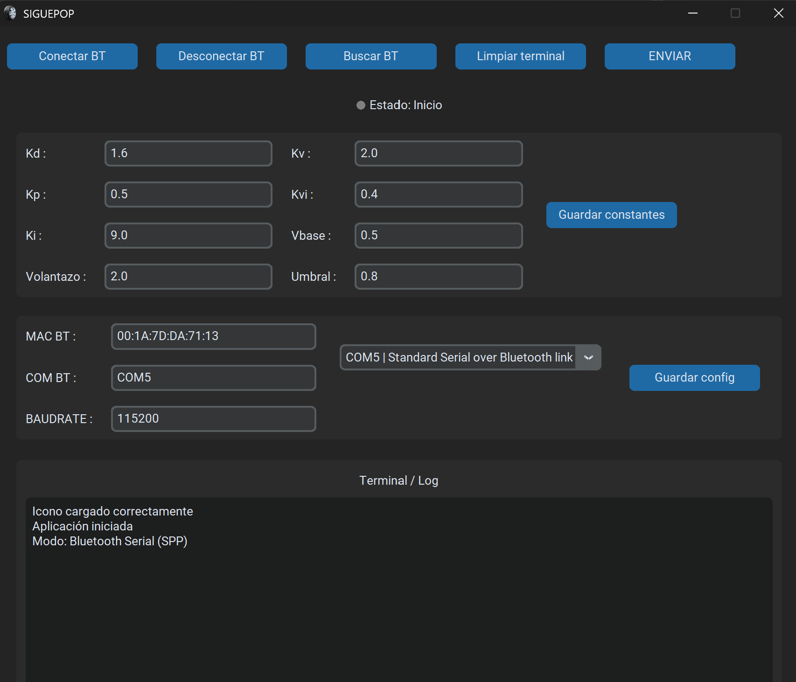

# SIGUEPOP

**SIGUEPOP** es una aplicación de escritorio desarrollada en Python para configurar y enviar parámetros de control a un robot siguelíneas basado en ESP32.

La aplicación permite ajustar constantes de control, guardar la configuración localmente y enviar los datos al microcontrolador mediante comunicación **Bluetooth Serial SPP**.

---

## Descripción del proyecto

Este proyecto nace como una herramienta sencilla para facilitar la calibración de un robot siguelíneas sin tener que modificar y recompilar el firmware cada vez que se quieran cambiar los parámetros de control.

Desde la interfaz gráfica se pueden modificar valores como las constantes PID, la velocidad base, el umbral de detección y otros parámetros del comportamiento del robot. Al pulsar el botón de envío, la aplicación manda los datos al ESP32 en formato JSON a través de un puerto COM Bluetooth.


## Interfaz de la aplicación



---

## Funcionalidades principales

- Interfaz gráfica de escritorio con **CustomTkinter**.
- Comunicación con ESP32 mediante **Bluetooth Serial SPP**.
- Búsqueda automática de puertos Bluetooth disponibles.
- Selección manual del puerto COM.
- Envío de parámetros en formato JSON.
- Recepción de respuesta del ESP32.
- Timeout de seguridad: si el ESP32 no responde en 4 segundos, la conexión se cierra.
- Guardado de configuración en un archivo `config.json`.
- Terminal integrada para visualizar logs de conexión, envío y respuesta.
- Icono personalizado para la aplicación.

---

## Parámetros configurables

La aplicación permite modificar y enviar los siguientes parámetros:

| Parámetro | Descripción |
|---|---|
| `KP` | Ganancia proporcional del controlador |
| `KI` | Ganancia integral del controlador |
| `KD` | Ganancia derivativa del controlador |
| `Kv` | Parámetro adicional asociado a velocidad |
| `Kvi` | Parámetro adicional asociado a velocidad/integral |
| `Vbase` | Velocidad base del robot |
| `Volantazo` | Intensidad de giro o corrección brusca |
| `Umbral` | Umbral de detección de línea |
| `COM` | Puerto COM asociado al ESP32 |
| `BAUDRATE` | Velocidad de comunicación serie |

---

## Tecnologías utilizadas

- Python
- CustomTkinter
- Tkinter
- PySerial
- JSON
- Bluetooth Serial SPP
- ESP32

---

## Estructura del proyecto

```txt
SIGUEPOP/
│
├── app.py              # Interfaz gráfica principal
├── bluetooth.py        # Gestión de conexión y envío por Bluetooth Serial
├── files.py            # Lectura y guardado de configuración JSON
├── main.py             # Punto de entrada de la aplicación
├── config.json         # Archivo de configuración
├── icono.ico           # Icono de la aplicación
├── serial_manager.py   # Versión alternativa para comunicación serie por cable
└── SIGUEPOP.spec       # Archivo de configuración para generar el .exe
